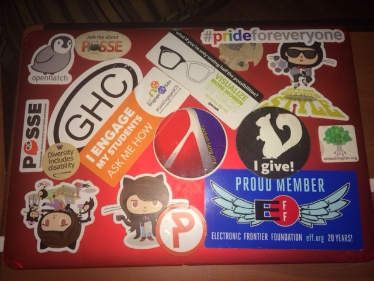

My Laptop
=========

*It seemed time for a less-serious piece, and a piece with an accompanying
image.  So here's a short essay about my laptop.*

---

I've had a lot of laptops in my career.  The first was a Wallaby, one of
the first Mac clones, and first portables.  It was really awesome ... you'd
take the ROM from your MacPlus, shove it in the Wallaby, and then you could
tether the Wallaby back to the MacPlus and have two screens.  It had a
separable keyboard.  And it was comparatively light.  I've had a number
of laptops since then (all Macs of some kind or other).  And, until
recently, I never did anything to the outside of them [1].

A few years ago, I was at an open-source conference, and I noticed that
most of the open-source folks seem to cover their laptops with stickers
of various sorts, partially as a way of making a statement.  And so I
decided to do the same.  Of course, I'm a bit conservative in how I treat
my electronics, so I ended up putting a case on my laptop first, and 
then putting stickers on the case.  My first case eventually gave up the
ghost (fortunately, before the laptop did) and so I moved on to a second.
Here's what it looks like now.

So, what are the stickers from, and what do they say about me?  As you've
seen in [a previous essay](diversity-in-cs.html), I care a lot about *diversity*
in my discipline.  So I have a "Visualize More Women in Computing" sticker
from NCWIT [2], a Grace Hopper Celebration Sticker [3], and a "Diversity
includes disability" sticker from the UW Access Computing Initiative.
I picked up the "#prideforeveryone" sticker at Google, and I think it
also speaks to my goals of being inclusive.

There are a few stickers that speak to my concerns about *open source*.
The two POSSE stickers are from the Professors' Open Source Software
Experience (not from the Posse that brings diversity to Grinnell), which
ties to a group of folks I work with who look at Humanitarian Free and
Open Source (aka HFOSS).  The OpenHatch sticker is for an initiative to
make open source projects more accessible to students.  

At my core, I'm a *computer science educator*.  So I have a sticker from
NCWIT's EngageCSEdu Initiative and a sticker from my friend Colleen's
csteachingtips.org. The large lambda in the middle of my computer is
from DrRacket, a functional language that has been at the core of
our introductory course for as long as I've been at Grinnell.  I also
really like functional programming, so the GHC sticker serves a second
purpose as representing the Glorious Haskell Compiler [4].

On the lighter side, I have a few *GitHub* stickers.  I like GitHub stickers
because there's a wide variety of them, and most of them either play off
on a meme (GitHub Style) or speak to important issues.  I put the two
stickers on the lower-left to reflect two sides of my personality.  I'm
a parent with kids, and I'm also a professional.  (Yes, I'm aware that
the Octocat appears female.  I'm still a parent and a professional, and
I don't care what gender represents me on the laptop.)

While diversity in CS is one of my passions as a CS educator and
professional, I also think that I have a broader responsibility to
consider the *social implications of computer technology* and to 
promote better uses of technology.  I support the Electronic Frontier
Foundation for their efforts on a wide variety of technology issues.
They gave me this sticker, so I put it on my laptop

Before I get to the last three stickers, I should reflect on things about
myself that aren't represented on my laptop.  I don't have things about
my family, my politics, or my passion for the arts.  (Well, one of the
GitHub stickers represents family, and the EFF and diversity stickers
speak to some aspects of my politics.)  I'll have to think more closely
about how I more clearly incorporate the arts the next time I sticker
my laptop.

Finally, I care a lot about *Grinnell*, so there are three Grinnell
stickers.  Under the "#prideforeveryone" sticker is a fading sticker
from our center for Careers, Life, and Service.  I love that Mark Peltz
arranged a social media campaign with the symbol, and for months, people
though it was a strange art project.  I do wish that he'd made higher
quality stickers.  I'm pretty sure that the strange P at the bottom
of my laptop is from Pioneer Weekend, a student-led startup event [5].
Finally, there's the black squirrel sticker.  (Okay, it's a white squirrel
on a black background.)  The College gave it to donors on "Scarlet and
Give Back Day".  I looked at it, and the first thing I thought was "Wow,
that's an interesting response to the phrase 'I don't give a rat's ass.'"
That's, right, here at Grinnell, we give a squirrel's ass.

---

[1] Well, they'd end up scratched and dented, but that wasn't intentional.  

[2] National Center for Women in Technology.

[3] We'll talk more about the GHC sticker later.

[4] Or is it Glasgow Haskell Compiler?  I can never remember.

[5] Yeah, that's one of those things I love about Grinnell.  Other
schools may have startup events, but they are typically arranged by
administrators.  At Grinnell, our students designed the startup weekend,
and organizations at the College provided infrastructure and funding.
